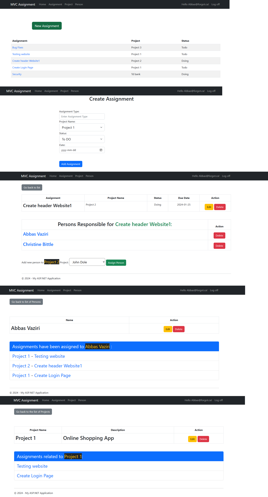

# Assignment-Tracker-Application

## Overview

Welcome to My  Assignment Tracker CMS, a web application developed using C# with the MVC (Model-View-Controller) architecture. This application is allow users to organize, prioritize, and track progress with assignments through variety of projects.
This project addresses challenges related to task organization, user assignment, project tracking, status updates (Todo, Doing, Done), collaboration, due date management, and reporting.

## Live Website

## Technologies Used

- **ASP.NET MVC:** The Model-View-Controller architecture is employed for a modular and organized front. C# programming language for server-side logic, offering strong typing and robust features.
- **HTML5 CSS JS:** Standard web technologies are used for the structure and styling of the application.
- **Entity Framework:** An Object-Relational Mapping (ORM) framework for database interactions, providing a simplified data access layer.
- **SQL:** The relational database management system stores and manages data.

## Installation
1. Clone this repository: git clone https://github.com/abiasV/My-Passion-Project.git
2. Navigate to the project directory: cd My-Passion-Project

## Features

1. **Assignments Table**:
   - Navigate to the Assignments section.
   - Click on "Create Assignments" to add a new assignment.
   - Fill in the required details and save the assignment.
   - View, update, or delete assignment as needed.
   - Assign persons to assignments for any project.
   - Delete persons from assignments.

2. **Projects Table**:
   - Go to the Projects section.
   - View, add, update or delete project as needed.
   - View assignments related to each project.

3. **Persons Table**:
   - Navigate to the person section.
   - Click on "Create person" to add a new person.
   - Fill in the required details and save the person.
   - View, update, or delete person as needed.
   - We can add this user while creating new assignment.
   - View assigned assignments to each person.

## Potential Future Features

- Adding and Deleting person profile picture.
- Search option for status of assignment which one have not been start yet.
- Search option for status of assignment which one have been completed.
